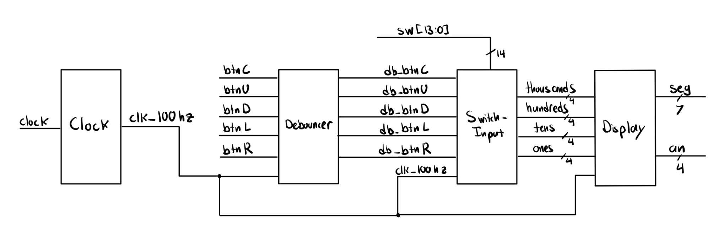

# Binary Learning Display

This Vivado-based project serves as an interactive tool for beginners to explore binary and decimal conversions. By manipulating switches and observing the corresponding output on a seven-segment display, users gain practical experience in base-2 to base-10 translation, arithmetic operations, and bitwise shifting—all in real time.

## Context and Motivation

**Problem:**
- Translating binary to decimal can be cumbersome and error-prone.
- Reliance on online tools or manual calculations slows down learning.
- Bitwise operations often lead to mistakes without immediate feedback.

**Solution:**
- Offers an interactive system for converting binary values from switches to a decimal display.
- Includes simple arithmetic (addition and subtraction) and left/right shifting for further exploration.
- Encourages hands-on learning of binary arithmetic and digital design principles.

## Key Features

- **Switches:**
  - 14 switches represent a binary number (up to 9999 in decimal).
  - "High" (up) indicates 1, while "Low" (down) indicates 0.
  - User-friendly mechanism to enter and modify binary values.

- **Center Button:**
  - Transfers the binary value on the switches to the display.
  - Acts as a "reset" to synchronize displayed data with the current switch state.

- **Up/Down Buttons:**
  - Increment or decrement the displayed value by one.
  - Demonstrates simple arithmetic in real time.

- **Left/Right Buttons:**
  - Shift the displayed value left or right by one bit (logical shift).
  - Illustrates fundamental bitwise operations.

## Demonstration

Showcases the tool in action, highlighting how switch toggles and button presses reflect on the seven-segment display.

## Circuit Design

A system-level block diagram (image) illustrates how the modules interface to provide seamless binary-to-decimal conversion and display.

  

- **Clock Module:**
  - Divides a 100 MHz input into slower signals (e.g., 100 Hz) for stable display updates and debouncing.
  - Originally configured to generate 1 Hz, 1.5 Hz, and 2 Hz signals as well.

- **Debouncer Module:**
  - Samples button signals at 100 Hz to eliminate noise.
  - Ensures reliable button transitions without mechanical glitches.

- **Switch Input Module:**
  - Converts the 14 switch inputs and button presses into a base-10 value.
  - Updates four-digit outputs (thousands, hundreds, tens, ones) with each clock cycle.

- **Display Module:**
  - Drives a four-digit seven-segment display.
  - Uses a 100 Hz multiplexing approach to minimize flicker and clearly present numerical data.

## Getting Started

1. **Open in Vivado:**  
   Import the project into Vivado. Assign the correct FPGA device and run synthesis.

2. **Simulate and Verify:**  
   Use the provided testbench (`tb.v`) to confirm functionality of each module.

3. **Program the FPGA:**  
   Generate a bitstream and flash the design onto hardware. Interact with switches and buttons to observe the real-time binary/decimal conversion.

## Project Structure

```markdown
binary_display.srcs/
├── sim_1/
│   └── new/
│       └── tb.v
└── sources_1/
    └── new/
        ├── clock.v
        ├── debouncer.v
        ├── display.v
        ├── master.v
        └── switch_input.v

demo.mov
module_diagram.jpeg
README.md
.gitignore
```